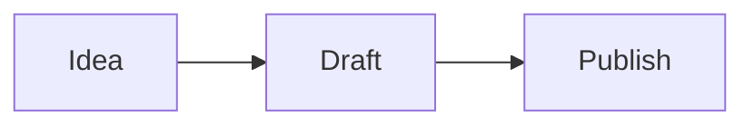

# First Post

This is the first post for the blog.

## Writing

Create new posts in `_posts` with filenames like:

```text
2026-05-01-post-title.md
```

## Tip Block

> ##### TIP
>
> You can use GitBook-style callout blocks in this theme.
{: .block-tip }

## Mermaid


